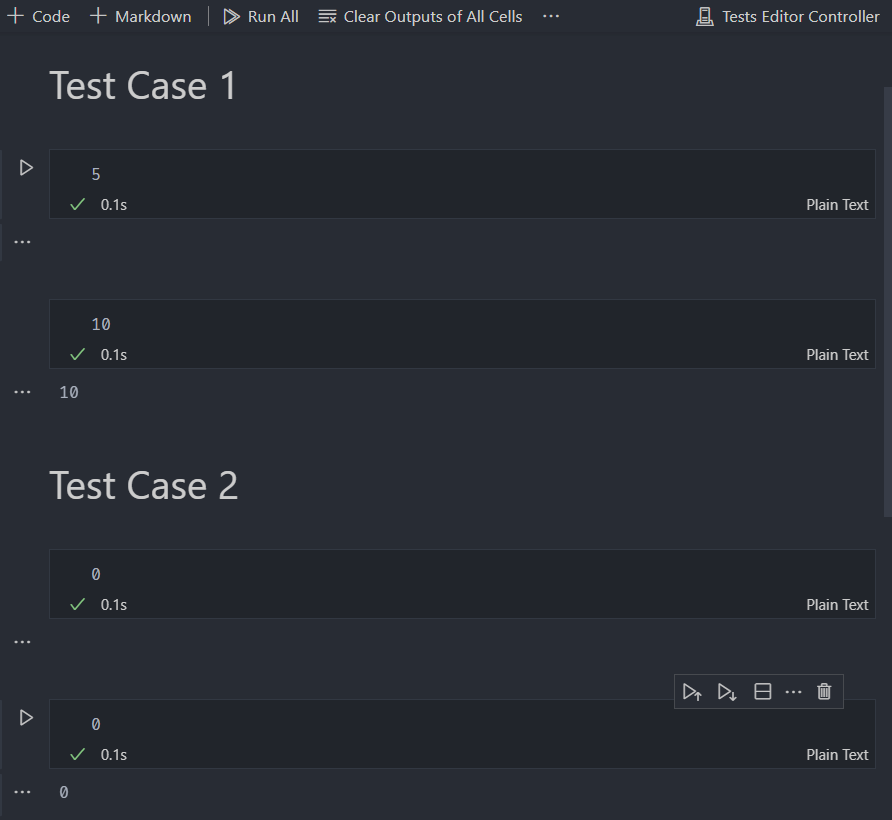

# Competitive Assistant

A VSCode extension that helps you test input and output
for competitive programming.

## Features

- Run test cases using a notebook-based viewer

## Inspiration

Inspired by the [CPH](https://github.com/agrawal-d/cph)
extension for VSCode and the
[AutoCp](https://github.com/Pushpavel/AutoCp) plugin for
IntelliJ-based IDEs
